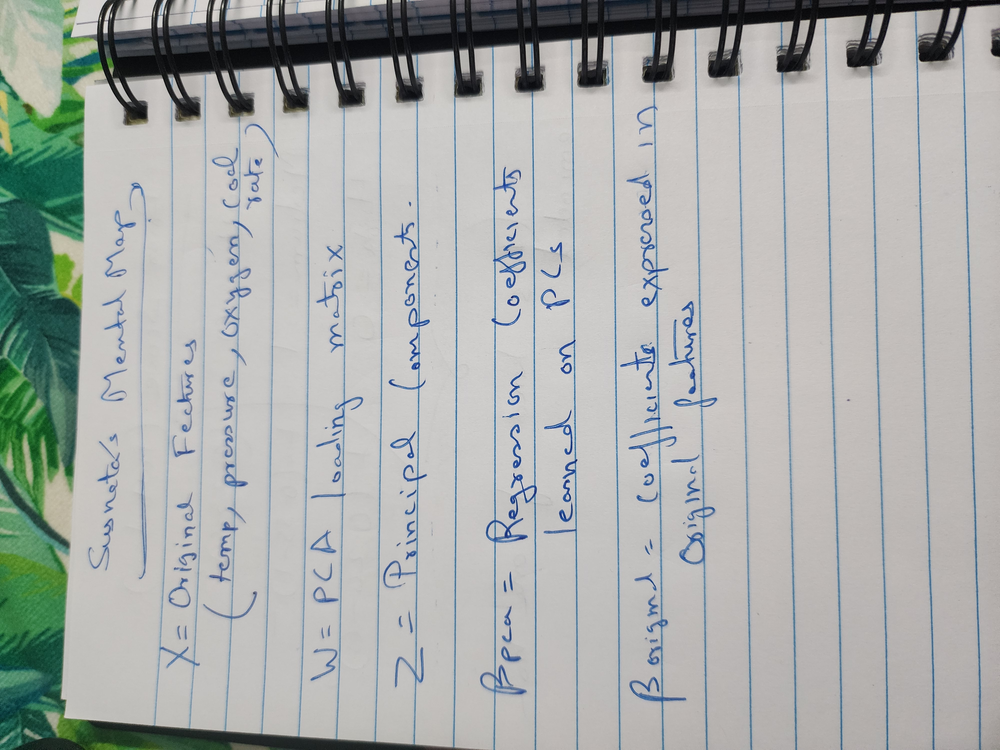
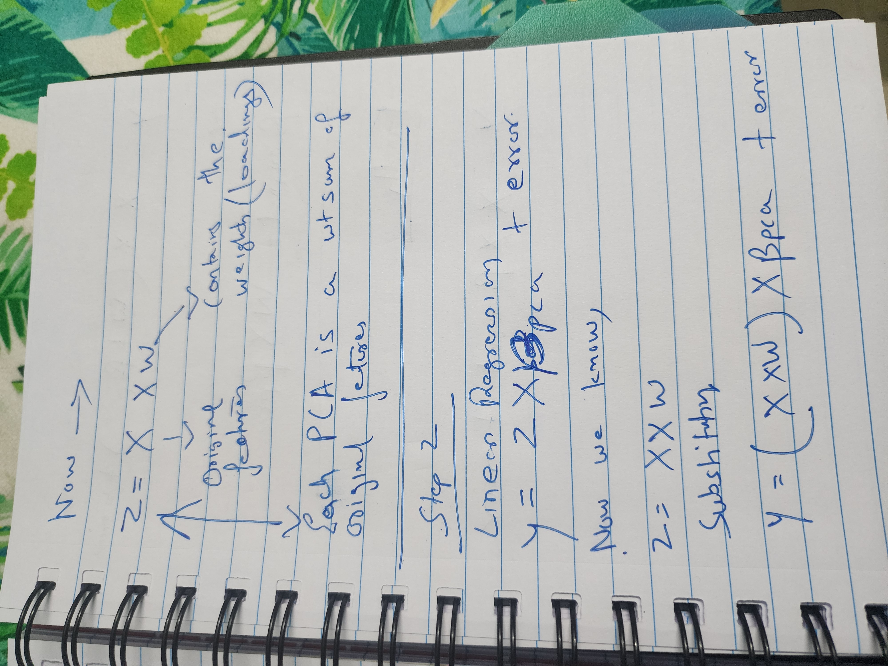
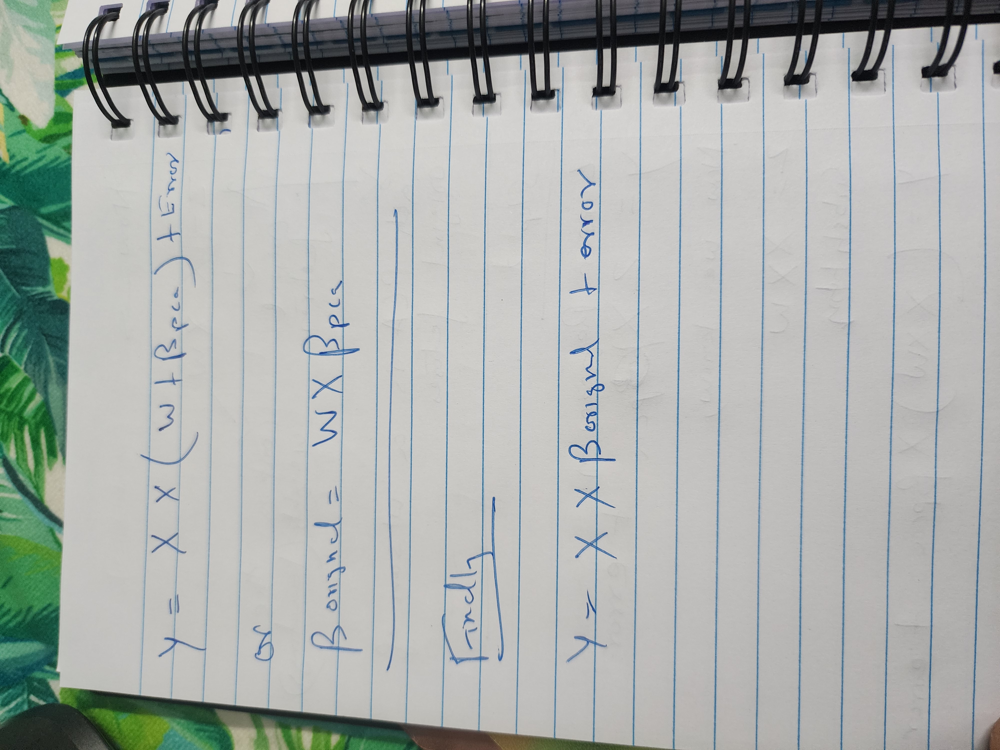
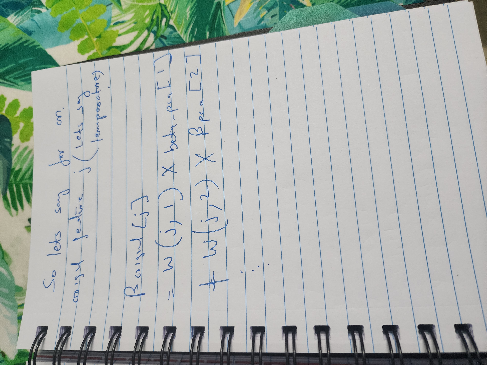

# PCA Loadings Back-Mapping  
**From Principal Components back to Original Features**

No approximation.  
No heuristics.  
Pure linear algebra.

---

## 🧠 Notation & Mental Model

  

Let:

- **X** = Original feature matrix  
  (e.g., temperature, pressure, oxygen, coal rate)

- **W** = PCA loading matrix  
  (weights defining how original features form principal components)

- **Z** = Principal component matrix

- **βₚ𝚌ₐ** = Regression coefficients learned on principal components

- **βₒᵣᵢgᵢₙₐₗ** = Coefficients expressed in original feature space

Each principal component is simply a **weighted sum of original features**.  
Nothing mystical—just linear algebra.

---

## 🔁 Step 1: PCA Projection  
**(Feature Space → PC Space)**

  

PCA applies a linear transformation:

\[
Z = XW
\]

This means:
- Original features are projected onto orthogonal directions
- Each PC captures variance as a weighted combination of features

At this stage:
- Interpretability is reduced  
- But **structure and signal are preserved**

---

## 📐 Step 2: Regression on Principal Components

We train a linear model **on the PCs**, not directly on original features:

\[
y = Z \beta_{\text{PCA}} + \varepsilon
\]

This is done to:
- Reduce multicollinearity
- Improve numerical stability
- Work in a compressed, decorrelated space

However, coefficients are now expressed in **PC space**, not feature space.

---

## 🔄 Step 3: Back-Mapping PCA Loadings

  

Substitute the PCA projection into the regression equation:

\[
Z = XW
\]

\[
y = (XW)\beta_{\text{PCA}} + \varepsilon
\]

Rearranging:

\[
y = X (W \beta_{\text{PCA}}) + \varepsilon
\]

This yields the key result:

\[
\beta_{\text{original}} = W \beta_{\text{PCA}}
\]

This is **PCA loadings back-mapping**.

No assumptions added.  
No approximation introduced.

---

## 🔍 Step 4: Feature-Level Interpretation

  

For a specific original feature *j*:

\[
\beta_{\text{original}}^{(j)} =
\sum_{k=1}^{K} W_{j,k} \cdot \beta_{\text{PCA}}^{(k)}
\]

This shows:

- Each original feature’s influence is an **aggregation of its contributions across PCs**
- PCA does **not destroy interpretability — it delays it**
- Back-mapping restores **decision-ready coefficients** in the original feature space

---

## 🔐 Variance Retention & Information Preservation

Although PCA expresses features as linear combinations, the selected principal components retain **~98% of the total variance**.

This implies:

- Very little information is discarded
- The dominant structure of the data is preserved
- Back-mapped coefficients remain **reliable and meaningful**

In this context, PCA acts as a **rotation and compression**, not a destructive transformation.

---

## 🎯 Why This Matters (Business + ML)

- Enables explanation of PCA-based models to non-technical stakeholders  
- Allows ranking of original features after dimensionality reduction  
- Makes PCA compatible with interpretability tools (e.g., SHAP)  
- Avoids the “black-box PCA” trap  

📌 Notes on Scaling, PCA, and Regularization
All features were standardized before PCA, so regression coefficients and SHAP values are expressed in scaled units, ensuring fair comparison across variables with different physical ranges.
PCA introduces an implicit Ridge-like effect by projecting correlated features into orthogonal components, stabilizing coefficient estimation under multicollinearity without explicitly applying Ridge regression.
